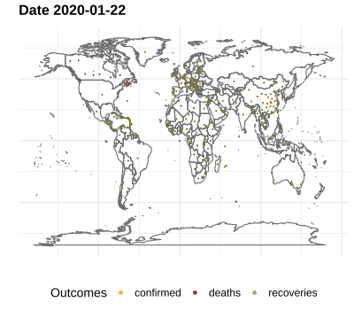

```{r setup, include=FALSE}
knitr::opts_chunk$set(fig.width=8, fig.height=5, echo=FALSE, warning=FALSE, message=FALSE, error = FALSE, fig.pos='center', cache=FALSE, progress=TRUE)

options(shiny.error =  function() {
    stop("")
  },
  shiny.reactlog = TRUE,
  shiny.sanitize.errors = FALSE)

# Get packages ------------------------------------------------------------
# get_package <- function(package){
# if (!package %in% installed.packages()){
#     install.packages(package)
# }
#     invisible(library(package, character.only = TRUE))
# }

library(DT)
library(flexdashboard)
library(ggmap)
library(gganimate)
library(ggthemes)
library(janitor)
library(jsonlite)
library(leaflet)
library(lubridate)
library(maps)
library(plotly)
library(sf)
library(shiny)
library(tidyverse)
library(tmaptools)

# packages_required <- c("tidyverse", "jsonlite", "sf", "tmaptools", "janitor", "shiny",
#                        "leaflet", "maps", "ggmap", "ggthemes", "gganimate","lubridate",
#                        "flexdashboard", "DT", "plotly")
# sapply(packages_required, get_package)

```

```{r import data}
# Data acquired from: https://github.com/CSSEGISandData/COVID-19/tree/master/csse_covid_19_data
covid_death <- read_csv("https://raw.githubusercontent.com/CSSEGISandData/COVID-19/master/csse_covid_19_data/csse_covid_19_time_series/time_series_19-covid-Deaths.csv")
covid_recoveries <- read_csv("https://raw.githubusercontent.com/CSSEGISandData/COVID-19/master/csse_covid_19_data/csse_covid_19_time_series/time_series_19-covid-Recovered.csv")
covid_confirmed <- read_csv("https://raw.githubusercontent.com/CSSEGISandData/COVID-19/master/csse_covid_19_data/csse_covid_19_time_series/time_series_19-covid-Confirmed.csv")


```


```{r preprocess data}
convert_to_long <- function(df = covid_death, val_name = "deaths"){
    df %>%
        clean_names(case = 'snake') %>%
        pivot_longer(cols = starts_with('x'),
                     names_to = "date", values_to = val_name) %>%
        mutate(date = mdy(gsub('x','', date)))
}

deaths_long <- convert_to_long(covid_death, "deaths")
recoveries_long <- convert_to_long(covid_recoveries, "recoveries")
confirmed_long  <- convert_to_long(covid_confirmed, "confirmed")

covid_master <- confirmed_long %>%
    full_join(deaths_long, by = c("date","province_state", "country_region","lat","long")) %>%
    full_join(recoveries_long, by = c("date", "province_state", "country_region","lat","long"))

# Get the latest 
covid_latest <- covid_master %>% 
    group_by(lat,long) %>%
    filter(!is.na(confirmed)) %>% 
    filter_at(vars(starts_with("date")), any_vars(. == max(., na.rm = TRUE))) %>% 
     mutate(content = paste(paste0(province_state,', ' ,country_region), 
                           paste("# of confirmed =", confirmed), 
                           paste("# of deaths =", deaths),
                           paste("# of recovered =", recoveries),
                           sep = "<br/>")) %>% 
    pivot_longer(cols = c(confirmed, deaths, recoveries), names_to = "outcome", values_to = "total")

covid_latest_filtered <- reactive({
    if(input$country == "All countries"){
  covid_filt <- covid_latest
  } else {
    covid_latest %>% 
      dplyr::filter(country_region %in% input$country) 
  }
})
```

Home
=================================================================
Column {.sidebar}
-----------------------------------------------------------------------
```{r filters}
selectizeInput("country", 
               "Country",         
               choices = c("All countries", unique(covid_latest$country_region)),
               multiple = TRUE,
               width = '100%',
               selected = "All countries")


```

row
---------------------------------------------------------------
### Confirmed

```{r}
renderValueBox({
    valueBox(value = format(sum(covid_latest$total[covid_latest$outcome == 'confirmed']), big.mark = ","), 
           caption = "<b># of Confirmed</b>", 
           icon = HTML(''), 
           color = "orange")

})
```

### Deaths

```{r}
renderValueBox({
    valueBox(value = format(sum(covid_latest$total[covid_latest$outcome == 'deaths']), big.mark = ","), 
           caption = "<b># of Deaths</b>", 
           icon = "fa-skull-crossbones", 
           color = "darkred")

})
```

### Recoveries

```{r}
renderValueBox({
    valueBox(value = format(sum(covid_latest$total[covid_latest$outcome == 'recoveries']), big.mark = ","), 
           caption = "<b># of Recoveries</b>", 
           icon = "fa-pills", 
           color = "#77AF43")

})
```

Column {data-height=1000, data-width=1000, style="height:100pc;" .tabset .tabset-fade}
-----------------------------------------------------------------------

### Global aggregates over time

```{r}
# Plot totals
global_tot <- covid_master %>%
    group_by(date) %>%
    summarise(confirmed = sum(confirmed, na.rm = TRUE),
              deaths = sum(deaths, na.rm = TRUE),
              recoveries = sum(recoveries, na.rm = TRUE)) %>%
    pivot_longer(-date, names_to = "outcome", values_to = "total")

global_total_over_time <- global_tot %>%
    ggplot(aes(x = date, y = total, colour = outcome)) +
        geom_line() + geom_point() +
        theme_minimal() +
        geom_text(data = global_tot %>%
                      filter(date == max(.$date)),
                  aes(label = outcome, colour = outcome, x = max(date), y = total),
                  size = 8, nudge_y = 1500, nudge_x = -3) +
        theme(legend.position = 'none') +
        labs(title = "Coronavirus global outcomes - 2020",
             x = "Date", y = "Cumulative total", color = "Outcomes") +
        scale_colour_manual(values = c("orange", 'darkred', "#77AF43"))

global_total_over_time %>% 
    ggplotly()
```


### Reported incidents of coronavirus across the globe

```{r geolocate,fig.width=12, fig.height=8}
output$coronavirus_plot <- renderLeaflet({
  covid_latest_filtered() %>%
    leaflet(., options = leafletOptions(
                zoomControl = TRUE)) %>%
    addTiles() %>%
    addMarkers(lat = ~lat, lng = ~long, popup = ~content) 
})
  
leafletOutput('coronavirus_plot', height = 500, width = 600)    
```

### Spread over time
```{r, out.width = "2000px"}

```

Data
==============================================
```{r}
DT::renderDataTable(covid_latest_filtered() %>% 
                      select(-content) %>% 
                      pivot_wider(names_from = outcome, values_from = total), 
                    server = TRUE,
                    extensions = c("Responsive", "Buttons"),
                    class = "display",
                    options = list(searchHighlight = TRUE,
                                    pageLength = 20,
                                    fixedColumns = TRUE,
                                    autoWidth = TRUE,
                                    ordering = TRUE))
```

